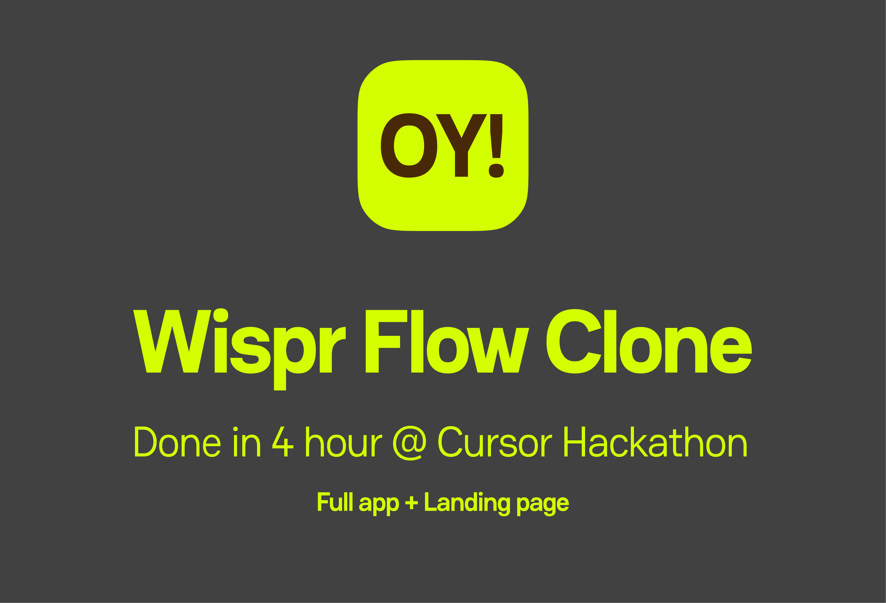

# Open Yapper (OY!)



**Done in 4 hours @ Cursor Hackathon** — Full app + Landing page

---

## What is Open Yapper?

**Open Yapper** (OY!) is the GEN Z voice dictation app. It's an open-source clone of [Wispr Flow](https://whisperflow.app/) / WhisperFlow—ramble naturally, AI cleans the mess, no cap.

Stop typing, start talking. Speak into your mic, and Open Yapper transcribes your voice, removes filler words (um, uh, like, you know), and turns your rambled thoughts into polished text ready to paste anywhere—Gmail, Slack, Notes, ChatGPT, you name it.

### Key Features

- **Voice-to-text transcription** — Record your voice and get clean, formatted text
- **Filler word removal** — Automatically strips "um," "uh," "like," and other verbal hiccups
- **Gen Z mode** — Optional rewrite into Gen Z slang (lowkey, no cap, slay, it's giving, etc.)
- **Per-app customization** — Set tone (casual, formal, etc.) and target app hints
- **Global hotkeys** — Press **⌥ Space** (Option+Space) to start/stop recording on macOS
- **History & stats** — Browse past recordings, copy text, and see usage stats
- **Paste anywhere** — Uses accessibility APIs to paste directly into the focused app

### Tech Stack

- **Flutter** — Cross-platform (macOS, iOS, Android, Web, Windows)
- **Google Gemini** — AI transcription and text refinement
- **Native macOS integration** — Hotkeys, accessibility, microphone permissions

---

## Download

**Get the app from [www.openyapper.com](https://www.openyapper.com)**

The website hosts the landing page and download links for the latest builds. Visit to download the macOS app (and other platforms as they become available).

---

## How to Run (Development)

### Prerequisites

- [Flutter SDK](https://flutter.dev/docs/get-started/install) (3.10+)
- [Dart](https://dart.dev/) 3.10+
- A [Google Gemini API key](https://aistudio.google.com/apikey) (free tier available)

### 1. Clone the repo

```bash
git clone https://github.com/your-org/open_yapper.git
cd open_yapper
```

### 2. Install dependencies

```bash
flutter pub get
```

### 3. Add your Gemini API key

The app requires a Gemini API key for transcription. On first launch, you'll see an onboarding screen where you can paste your key. It's stored securely in the system keychain (macOS) or equivalent.

You can also set it via the Settings screen after onboarding.

### 4. Run the app

**macOS (primary platform):**

```bash
flutter run -d macos
```

**Other platforms:**

```bash
# iOS (requires Xcode and a Mac)
flutter run -d ios

# Android
flutter run -d android

# Web
flutter run -d chrome

# Windows
flutter run -d windows
```

### 5. Grant permissions

On first run, the app will ask for:

- **Microphone** — To record your voice
- **Accessibility** — To paste text into other apps (macOS)

Grant both in System Settings when prompted.

### 6. Start recording

- Press **⌥ Space** (Option+Space) to toggle recording
- Or hold the hotkey to record while pressed
- Speak naturally—the AI will clean up filler words and format the output
- The text is pasted into the currently focused app when done

---

## Project Structure

```
open_yapper/
├── lib/
│   ├── main.dart              # App entry, navigation, hotkey wiring
│   ├── screens/               # History, Stats, Customization, Settings
│   ├── services/              # Recording, Gemini, native bridge, storage
│   ├── views/                 # Onboarding flow
│   └── widgets/               # Reusable UI components
├── macos/                     # macOS native code (hotkeys, permissions)
├── android/                   # Android config
├── ios/                       # iOS config
├── web/                       # Web build
├── open_yapper_site/          # Next.js landing page (www.openyapper.com)
└── assets/                    # Icons, fonts, images
```

---

## Configuration

- **Hotkeys** — Change start/stop/hold hotkeys in Settings
- **Tone** — Choose casual, normal, informal, or formal
- **Gen Z mode** — Toggle in Customization to rewrite output in Gen Z slang
- **Target app** — Optional hint (e.g., "Gmail") for format adaptation

---

## License

This project is licensed under the **Apache License 2.0**.

---

**Open Yapper** — The GEN Z voice dictation app. Stop typing, start talking. 🎤
